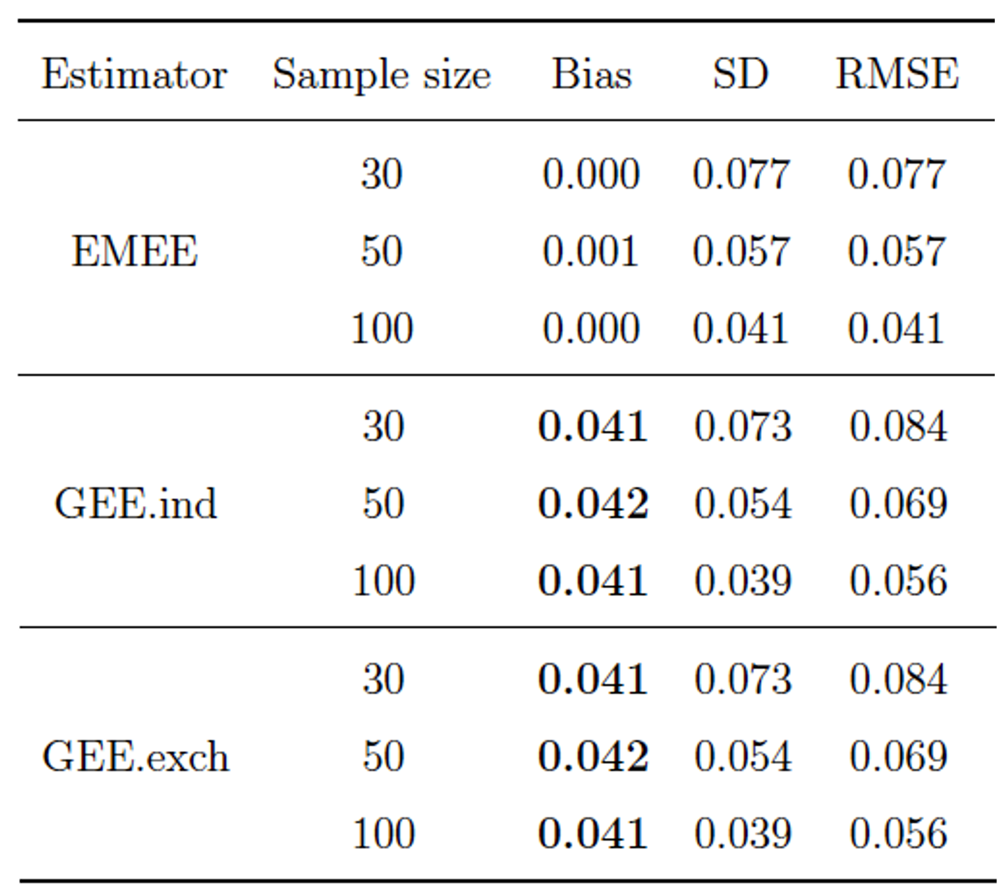

# Welcome
This is a course project page for MATH 888: Causal inference (Topics in mathematical data science).

## About Me
I am a Ph. D. candidate in the department of Mathematics at University of Wisconsin-Madison.
My research interests lie in theoretical understanding of machine learning.
In specific, I have worked on matrix completion with graph side information, and data poisoning attacks on algorithmic fairness.
For the first topic, I fully characterized the optimal sample complexity required for reliable estimation and quantified the efficacy of graph side information under a highly general model.
For the second one, I found the lower and upper bounds on the minimum data perturbation, measured in total variation distance, required for successful poisoning attack against risk minimization with fairness constraints.

With my background, I would like to design practical machine learning models with theoretical performace guarantees.
I think understanding causality can greatly improve machine learning models, so I am interested in studying causal inference.

## HW 2
#### Problem of interest
Mobile health interventions to people in their everyday life is available due to wearables and digital technology. The micro-randomized trial (MRT), where each individual is repeatedly randomized among multiple intervention options over the course of the trial, has been increasingly used to provide data to inform the construction of these interventions. In "Estimating Time-Varying Causal Excursion Effect in Mobile Health with Binary Outcomes, Qian et al. (2021)," the authors proposed the definition of causal excursion effect that can be used in primary aim analysis for MRTs with binary outcomes.

#### Variables
For each individual, there are $T$ time points at which the treatment can be delivered ($T$ does not have to be the same for each individual). A binary variable $A_t$ is a treatment option at time $t$, where $1$ means treatment and $0$ means no treatment. We denote by $X_t$ the vector of observations collected after time $t-1$ and up to time $t$. In specific, $X_1$ includes baseline covariates, and $X_t$ contains the availability indicator $I_t$ where $I_t = 1$ if the individual is available for treatment at time $t$ and $I_t = 0$ otherwise. If $I_t = 0$, randomization will not occur at time $t$ and then $A_t = 0$.

We use an overbar to denote a sequence of variables up to a time point. For example, $$\bar{A}_t = (A_1, \dots, A_t)$$. Information accumulated up to time $t$ is represented by the history $$H_t = (X_1, A_1, X_2, A_2, \ldots, X_{t-1}, A_{t-1}, X_t) = (\bar{X}_t, \bar{A}_{t-1})$$. The observed data on a generic individual is $$O= (X_1, A_1, \ldots, X_T, A_T, X_{T+1})$$.

The proximal outcome $Y_{t,\Delta}$, following the treatment assignment at time $t$, is a known function of the individual's data within a subsequent window of length $\Delta$, where $\Delta \geq 1$ is a positive integer. That is, $Y_{t,\Delta} = y(X_{t+1}, A_{t+1}, \ldots, X_{t+\Delta-1}, A_{t+\Delta-1}, X_{t+\Delta})$ for some known function $y(\cdot)$.

#### Causal effects we want to study
For an individual, let $$X_t(\bar{a}_{t-1})$$ and $$A_t(\bar{a}_{t-1})$$ be the observation that would have been observed and the $t$th treatment that would have been assigned, respectively, if s/he were assigned the treatment sequence $$\bar{a}_{t-1}$$. Then the potential outcomes are defined as
$$\{X_1, A_1, X_2(a_1), A_2(a_1), X_3(\bar{a}_2),\ldots, A_T(\bar{a}_{T-1}), X_{T+1}(\bar{a}_{T}) \mbox{ for all } \bar{a}_T \in \{0,1\}^{T}\}.$$
The potential outcome for the proximal outcome is $Y_{t,\Delta}(\bar{a}_{t+\Delta - 1})$. The potential history under the observed treatment sequence at time $t$ is $$H_t(\bar{A}_{t-1}) = (X_1, A_1, X_2(A_1), A_2, X_3(\bar{A}_2),\ldots, X_t(\bar{A}_{t-1}))$$.

We define the causal effect of $A_t$ on $Y_{t,\Delta}$ using the log relative risk scale:
$$\beta_M\{t, S_t(\bar{A}_{t-1})\} = \log \frac{ E \{ Y_{t,\Delta}(\bar{A}_{t-1}, 1, \bar{0}) \mid S_t(\bar{A}_{t-1}), I_t(\bar{A}_{t-1}) = 1 \} }{E \{ Y_{t,\Delta}(\bar{A}_{t-1}, 0, \bar{0}) \mid S_t(\bar{A}_{t-1}), I_t(\bar{A}_{t-1}) = 1 \}},$$
where $$S_t(\bar{A}_{t-1})$$ is a vector of summary variables formed from $$H_t(\bar{A}_{t-1})$$, and $\bar{0}$ is a zero vector of length $\Delta - 1$.
This causal effect denotes the contrast of the expected outcome under two "excursions" from the current treatment protocol: treatment at time $t$ and no treatment for the next $\Delta - 1$ time points, versus no treatment at time $t$ and no treatment for the next $\Delta - 1$ time points.

#### Hypothesis
The causal excursion effect can be used in primary aim analysis for MRTs with binary outcomes.

## HW 3
#### Causal effects we want to study
In "Estimating Time-Varying Causal Excursion Effect in Mobile Health with Binary Outcomes, Qian et al. (2021)," the authors proposed the causal effect of $A_t$ on $Y_{t,\Delta}$, which we call the causal excursion effect, using the log relative risk scale:
$$\beta_M\{t, S_t(\bar{A}_{t-1})\} = \log \frac{ E \{ Y_{t,\Delta}(\bar{A}_{t-1}, 1, \bar{0}) \mid S_t(\bar{A}_{t-1}), I_t(\bar{A}_{t-1}) = 1 \} }{E \{ Y_{t,\Delta}(\bar{A}_{t-1}, 0, \bar{0}) \mid S_t(\bar{A}_{t-1}), I_t(\bar{A}_{t-1}) = 1 \}},$$
where $$S_t(\bar{A}_{t-1})$$ is a vector of summary variables formed from $$H_t(\bar{A}_{t-1})$$, and $$\bar{0}$$ is a vector of length $\Delta - 1$.

#### Assumptions
To express the causal excursion effect in terms of the observed data, we make the following assumptions.

##### Assumption 1 (Consistency)
The observed data is equal to the potential outcome under observed treatment assignment. That is, $X_2 = X_2(A_1)$, $A_2 = A_2(A_1)$, and for each subsequent $t \leq T$, $$X_t = X_t(\bar{A}_{t-1})$$, $$A_t = A_t(\bar{A}_{t-1})$$, and $$X_{T+1} = X_{T+1}(\bar{A}_T)$$. This assumption implies $$Y_{t,\Delta} = Y_{t,\Delta}(\bar{A}_{t+\Delta-1})$$.

##### Assumption 2 (Positivity)
If $\mbox{Pr}(H_t = h_t, I_t = 1) > 0$, then $\mbox{Pr}(A_t = a \mid H_t = h_t, I_t = 1) > 0$ for $a \in \{0,1\}$.

##### Assumption 3 (Sequential ignorability)
For $1\leq t \leq T$, the potential outcomes $$\{ X_{t+1}(\bar{a}_t), A_{t+1}(\bar{a}_t), \ldots, X_{T+1}(\bar{a}_T): \bar{a}_T \in \{0,1\}^{T} \}$$ are independent of $A_t$ conditional on $H_t$.

Since the treatment is sequentially randomized with known probabilities, Assumptions 2 and 3 are satisfied by design. Assumption 1 may not hold if there is social interaction between individuals, however, authors did not consider such cases to maintain the focus of this study.

#### Identification of the causal effect and proof

The authors showed that, under Assumptions stated above,
the causal excursion effect can be written in terms of the observed data distribution as follows:
$$\beta_M\{t, S_t(\bar{A}_{t-1})\} = \log \frac{
E \left[ E \left\{ \prod_{j=t+1}^{t+\Delta-1} \frac{\mathbb{1}(A_j = 0)}{1 - p_j(H_j)} Y_{t,\Delta} \Big| A_t = 1, H_t, I_t = 1 \right\} \Big| S_t, I_t = 1 \right]
}{
E \left[ E \left\{ \prod_{j=t+1}^{t+\Delta-1} \frac{\mathbb{1}(A_j = 0)}{1 - p_j(H_j)} Y_{t,\Delta} \Big| A_t = 0, H_t , I_t = 1 \right\} \Big| S_t, I_t = 1 \right]
},$$
where we define $\prod_{j=t+1}^{t+\Delta-1} \frac{\mathbb{1}(A_j = 0)}{1 - p_j(H_j)} = 1$ if $\Delta = 1$.

We first show the following lemma.
##### Lemma 1
For any $1 \leq k \leq \Delta$, we have
$$\begin{align}
& E\{Y_{t,\Delta}(\bar{A}_{t-1},a,\bar{0})\mid H_t,A_t=a,I_t=1 \} \nonumber \\
= & E\bigg\{\prod_{j=t+1}^{t + k - 1}\frac{\mathbb{1}(A_{j}=0)}{1-p_j(H_{j})}Y_{t,\Delta}(\bar{A}_{t-1},a,\bar{0})\bigg|A_t=a,H_t,I_t=1\bigg\}. \label{eq:lem-proofuse}
\end{align}$$

A proof of Lemma 1:
For $k=1$, Lemma 1 holds by definition. We prove the lemma by induction on $k$.

Suppose the lemma holds for $k = k_0$ for some $1 \leq k_0 \leq \Delta - 1$. 
For convenience presentation, we denote by $\zeta = \prod_{j=t+1}^{t + k_0 - 1}\frac{\mathbb{1}(A_{j}=0)}{1-p_j(H_{j})}Y_{t,\Delta}(\bar{A}_{t-1},a,\bar{0})$. Then
$$\begin{align}
    & E(\zeta \mid H_{t+k_0}, A_t = a, I_t = 1) \nonumber \\
    = & E(\zeta \mid H_{t+k_0}, A_t = a, I_t = 1) \frac{E\{\mathbb{1}(A_{t+k_0} = 0) \mid H_{t+k_0}, A_t = a, I_t = 1 \} }{1 - p_{t+k_0}(H_{t+k_0}, A_t = a, I_t = 1)} \nonumber \\
    = & E\bigg\{ \zeta \times \frac{\mathbb{1}(A_{t+k_0} = 0)}{1 - p_{t+k_0}(H_{t+k_0}, A_t = a, I_t = 1)} \bigg| H_{t+k_0}, A_t = a, I_t = 1 \bigg\} \label{proofuse-iden-11} \\
    = & E\bigg\{ \prod_{j=t+1}^{t + k_0}\frac{\mathbb{1}(A_{j}=0)}{1-p_j(H_{j})}Y_{t,\Delta}(\bar{A}_{t-1},a,\bar{0}) \bigg| H_{t+k_0}, A_t = a, I_t = 1 \bigg\}, \nonumber
\end{align}$$
where the second last equality follows from Assumption 3 (sequential ignorability). Therefore, by the induction hypothesis and the law of iterated expectation we have
$$\begin{align}
    & E\{Y_{t,\Delta}(\bar{A}_{t-1},a,\bar{0})\mid H_t,A_t=a,I_t=1 \} = E(\zeta \mid H_t, A_t = a, I_t = 1) \nonumber \\
    = & E\bigg\{ \prod_{j=t+1}^{t + k_0}\frac{\mathbb{1}(A_{j}=0)}{1-p_j(H_{j})}Y_{t,\Delta}(\bar{A}_{t-1},a,\bar{0}) \bigg| H_t, A_t = a, I_t = 1 \bigg\},
\end{align}$$
i.e., we showed that the lemma holds for $k = k_0 + 1$. Therefore, the lemma holds for any $1 \leq k \leq \Delta$ by mathematical induction. $\Box$

In order to prove the indentifiability result, it suffices to show the following equality:
$$\begin{align}
& E\{Y_{t,\Delta}(\bar{A}_{t-1},a,\bar{0})\mid S_t(\bar{A}_{t-1}),I_t(\bar{A}_{t-1})=1\} \nonumber \\
= & E\bigg[E\bigg\{\prod_{j=t+1}^{t+\Delta-1}\frac{1(A_{j}=0)}{1-p_j(H_{j})}Y_{t,\Delta}\bigg|A_t=a,H_t, I_t = 1\bigg\}\bigg|S_t,I_t=1\bigg]. \label{proofuse-iden-0}
\end{align}$$

This can be proved as follows:
$$\begin{align}
& E\{Y_{t,\Delta}(\bar{A}_{t-1},a,\bar{0})\mid S_t(\bar{A}_{t-1}),I_t(\bar{A}_{t-1})=1\} \nonumber \\
= & E[E\{Y_{t,\Delta}(\bar{A}_{t-1},a,\bar{0})\mid H_t(\bar{A}_{t-1}), I_t(\bar{A}_{t-1})=1\}\mid S_t(\bar{A}_{t-1}),I_t(\bar{A}_{t-1})=1]   \label{proofuse-iden-1} \\
= & E[E\{Y_{t,\Delta}(\bar{A}_{t-1},a,\bar{0})\mid H_t,I_t=1\}\mid S_t,I_t=1]   \label{proofuse-iden-2} \\
= & E[E\{Y_{t,\Delta}(\bar{A}_{t-1},a,\bar{0})\mid H_t,A_t=a,I_t=1\}\mid S_t,I_t=1]   \label{proofuse-iden-3} \\
= & E\bigg[E\bigg\{\prod_{j=t+1}^{t+\Delta-1}\frac{1(A_{j}=0)}{1-p_j(H_{j})}Y_{t,\Delta}\bigg|A_t=a,H_t, I_t = 1\bigg\}\bigg|S_t,I_t=1\bigg], \label{proofuse-iden-4}
\end{align}$$
where the first equality follows from the law of iterated expectation, the second one follows from Assumption 1 (consistency), the third one follows from Assumption 3 (sequential ignorability), and the last one follows from Lemma 1. This completes the proof of the indentifiability result.

#### Conclusion
To identify the causal excursion effect, we need a variable $A_t$, which is a treatment option at time $t$, and a variable $X_t$, which is a vector of observations collected after time $t-1$. We also observe that the causal excursion effect denotes the contrast of the expected outcome under two "excursions" from the current treatment protocol.

## HW 4
In “Estimating Time-Varying Causal Excursion Effect in Mobile Health with Binary Outcomes, Qian et al. (2021),” the authors estimated the causal excursion effect $\beta$ as follows.

### Estimator
One of the estimators proposed by the authors is an estimator for the marginal excursion effect (EMEE).

We first recall the assumptions for identification.

##### Assumption 1 (Consistency)
The observed data is equal to the potential outcome under observed treatment assignment. That is, $X_2 = X_2(A_1)$, $A_2 = A_2(A_1)$, and for each subsequent $t \leq T$, $$X_t = X_t(\bar{A}_{t-1})$$, $$A_t = A_t(\bar{A}_{t-1})$$, and $$X_{T+1} = X_{T+1}(\bar{A}_T)$$. This assumption implies $$Y_{t,\Delta} = Y_{t,\Delta}(\bar{A}_{t+\Delta-1})$$.

##### Assumption 2 (Positivity)
If $\mbox{Pr}(H_t = h_t, I_t = 1) > 0$, then $\mbox{Pr}(A_t = a \mid H_t = h_t, I_t = 1) > 0$ for $a \in \{0,1\}$.

##### Assumption 3 (Sequential ignorability)
For $1\leq t \leq T$, the potential outcomes $$\{ X_{t+1}(\bar{a}_t), A_{t+1}(\bar{a}_t), \ldots, X_{T+1}(\bar{a}_T): \bar{a}_T \in \{0,1\}^{T} \}$$ are independent of $A_t$ conditional on $H_t$.

#### An estimator for the marginal excursion effect (EMEE)

We focus on estimation of $\beta_M(t, S_t)$ where $S_t$ is an arbitrary subset of $H_t$. Suppose $\Delta \geq 1$ is a positive integer. Recall that

$$\begin{align}
  \beta_M(t, S_t) =\log \frac{
E \left[ E \left\{ \prod_{j=t+1}^{t+\Delta-1} \frac{\mathbb{1}(A_j = 0)}{1 - p_j(H_j)} Y_{t,\Delta} \Big| A_t = 1, H_t, I_t = 1 \right\} \Big| S_t, I_t = 1 \right]
}{
E \left[ E \left\{ \prod_{j=t+1}^{t+\Delta-1} \frac{\mathbb{1}(A_j = 0)}{1 - p_j(H_j)} Y_{t,\Delta} \Big| A_t = 0, H_t, I_t = 1 \right\} \Big| S_t, I_t = 1 \right]
}.
\end{align}$$

We make a parametric assumption on $\beta_M(t, S_t)$. Suppose that for $1 \leq t \leq T$,
$$\begin{equation}
\beta_M(t, S_t) = S_t^T \beta \label{eq:model-maginal-binary}
\end{equation}$$
holds for some $p$-dimensional parameter $\beta$.  This model allows for time-dependent effects; $S_t$ could include a vector of basis functions of $t$.

We propose to use a marginal generalization of the following estimating function to estimate $\beta$.
$$\begin{align}
m_C(\alpha, \psi) = & \sum_{t=1}^{T} I_t e^{-A_t f(H_t)^T \psi}\{Y_{t,1} - e^{g(H_t)^T \alpha + A_t f(H_t)^T \psi}\} \tilde{K}_t
\begin{bmatrix}
g(H_t) \\
\{ A_t - p_t(H_t) \} f(H_t)
\end{bmatrix}, \label{eq:ee-conditional}
\end{align}$$
where 
$$\begin{align*}
 \tilde{K}_t = \frac{e^{f(H_t)^T \psi}}
{ e^{f(H_t)^T \psi}\{ 1-e^{g(H_t)^T\alpha} \} p_t(H_t)+ \{1-e^{g(H_t)^T\alpha+f(H_t)^T \psi} \} \{1-p_t(H_t)\} }.
\end{align*}$$
Then, the proposed estimating function is
$$\begin{align}
m_M(\alpha,\beta) = \sum_{t=1}^{T + \Delta - 1} I_t e^{-A_t S_t^T \beta} \{ Y_{t,\Delta} - e^{g(H_t)^T \alpha + A_t S_t^T \beta} \} J_t
\begin{bmatrix}g(H_t)\\
\{A_t - \tilde{p}_t(S_t)\} S_t
\end{bmatrix}, \label{eq:ee-marginal}
\end{align}$$
where $\exp\{g(H_t)^T \alpha\}$ is a working model for $E\{Y_{t,\Delta}(\bar{A}_{t-1}, 0, \bar{0}) \mid H_t, I_t = 1, A_t = 0\}$. 

Since the model is now on the marginal effect, we apply a weighting and centering technique. 
The weight at time $t$ is 
$$\begin{align}
J_t = \bigg\{ \frac{\tilde{p}_t(S_t)}{p_t(H_t)} \bigg\}^{A_t} \bigg\{ \frac{1 - \tilde{p}_t(S_t)}{1 - p_t(H_t)} \bigg\}^{1 - A_t} \times \prod_{j=t+1}^{t+\Delta-1} \frac{\mathbb{1}(A_j = 0)}{1 - p_j(H_j)},
\end{align}$$
where $$\tilde{p}_t(S_t) \in (0,1)$$ is arbitrary as long as it does not depend on terms in $H_t$ other than $S_t$. The product, $$\prod_{j=t+1}^{t+\Delta-1} \mathbb{1}(A_j = 0)/\{1 - p_j( H_j)\}$$, is standard inverse probability weighting for settings with $\Delta>1$. The ratio of probabilities, $$\{\tilde{p}_t(S_t)/p_t(H_t) \}^{A_t} [ \{1 - \tilde{p}_t(S_t)\} / \{1 - p_t(H_t)\} ]^{1 - A_t}$$, can be viewed as a change of probability.

The authors showed that EMEE is a consistent estimator under proper assumptions.

#### Theorem 1
Suppose $\beta_M(t, S_t) = S_t^T$ and Assumptions 1,2,3 hold, and that the randomization probability $p_t(H_t)$ is known. Suppose $$\beta^*$$ is the value of $\beta$ corresponding to the data generating distribution, $P_0$.
Let $\dot{m}_M$ be the derivative of $m_M(\alpha, \beta)$ with respect to $(\alpha, \beta)$. Let $(\hat\alpha, \hat\beta)$ be a solution to $\mathbb{P}_n m_M(\alpha,\beta) = 0$.
Under regularity conditions, $$\sqrt{n}(\hat\beta - \beta^*)$$ is asymptotically normal with mean zero and variance-covariance matrix $\Sigma_M$. A consistent estimator for $\Sigma_M$ is the lower block diagonal $(p\times p)$ entry of the matrix
$$\{\mathbb{P}_n \dot{m}_M(\hat\alpha, \hat\beta)\}^{-1}
\{\mathbb{P}_n m_M(\hat\alpha, \hat\beta) m_M(\hat\alpha, \hat\beta)^T\}$$
$$\{\mathbb{P}_n \dot{m}_M(\hat\alpha, \hat\beta)\}^{-1^T}$$.

### Simulation

#### Dataset

We use a synthetic dataset generated as follows. The time-varying covariate, $Z_t$, is independent of all variables observed before $Z_t$, and it takes three values $0,1,2$ with equal probability. The randomization probability is constant with $p_t(H_t) = 0.2$. The outcome $Y_{t,1}$ is generated from a Bernoulli distribution with
$$\begin{align*}
  E(Y_{t,1} \mid H_t, A_t) = \big\{0.2 \mathbb{1}_{Z_t = 0} + 0.5 \mathbb{1}_{Z_t = 1} + 0.4 \mathbb{1}_{Z_t = 2} \big\} e^{A_t (0.1 + 0.3 Z_t)}.
\end{align*}$$
Here, $Z_t$ moderates the conditional treatment effect: The true conditional treatment effect $\beta_C(t,H_t)$ equals $0.1 + 0.3 Z_t$.

We first consider estimating the fully marginal excursion effect, which is equal to
$$\begin{align*}
\beta_0 = \log \frac{E\{ E(Y_{t,1} \mid H_t, A_t = 1) \}}{ E \{ E(Y_{t,1} \mid H_t, A_t = 0) \}} = 0.477.
\end{align*}$$
This is the setting of a typical primary analysis of MRT. In order to estimate $\beta_0$, by Theorem 1 it is appropriate to use the EMEE estimator with $S_t = 1$. 
For comparison, we also include the generalized estimating equations (GEE) estimator, which is widely used in analyzing mHealth data. We use independence ("GEE.ind") and exchangeable ("GEE.exch") as working correlation structures for GEE.

#### Simulation results

[Table1, Qian et al. (2021)]

The simulation result for estimating $\beta_0$ is given in Table 1; the total number of time points is $T=30$ for each individual. The bias, standard deviation (SD), and root mean squared error (RMSE) are all computed based on 1000 replicates. As expected, EMEE consistently estimates $\beta_0$. The consistency of GEE generally requires the working model $g(H_t)^T \alpha$ to be correct; in other words, it does not have the robustness property as EMEE. The result shows that both GEE.ind and GEE.exch are inconsistent.

